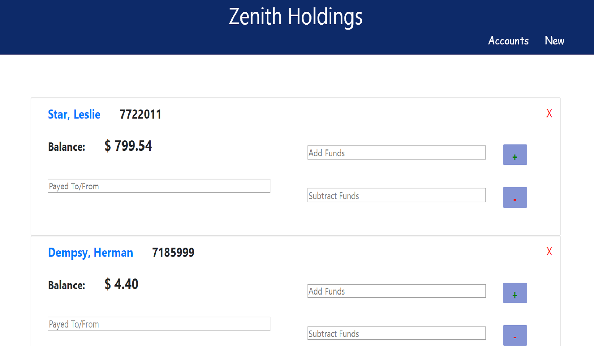

# Zenith Holdings
This project is a mobile-responsive, MERN, full-stack, app for managing an imaginary bank's customers' credit and debits. I had a blast in this project mixing react with Typescript. I hope you enjoy playing around in it as much as I enjoyed making it !!!

### Getting Started

link to project here: 

https://bank-manager-app-9485.herokuapp.com/

### About

From the main page (accounts), you can see all of the accounts currently available for manipulation. To credit an account, type a value into the pay to/from box and an ammount in either the 'Add Funds' or 'Subtract Funds' input. By clicking on the button corresponding to the input, you can add or subtract funds accordingly. Clicking on an 'X' will remove an account and all of its contents from the database. 

If you click a name, you will be taken to an individual's account listing all of the credits and debits. To delete and entry, simply click the red 'X' at the end of the credit/debit line. Upon deletion, the account balance will be updated accordingly. 

On the 'New' page, you can create a new account that is immediately available for manipulation.

### Technologies Used

| Technology | Use |
| --- | --- | 
Javascript | backend language | use with mongoDB, less initial setup than typescript (small back-end), |
nodejs | used for backend js |
Typescript| front-end language | 
React | library | 
MongoDB | database | 
axios | simple communication between front-end and back-end |
yarn | package manager of choice | 
normalize.css | make css appear consistent across browsers | 

### Acknowledgements

In this project, I chose a minimalistic styling scheme. My choice was to focus on showing off various animations, validation functions, and content-formating functions. I also placed heavy emphasis on making the mobile version have a mobile feel.

 
